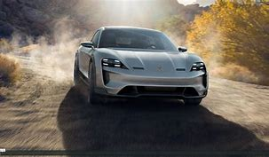

<!DOCTYPE html>
<html lang="en">
<head>
    <meta charset="UTF-8">
    <meta name="viewport" content="width=device-width, initial-scale=1.0">
    <title>Welcome to Virtual Car Museum</title>
    
</head>
<body>

<header>
    <h1> Virtual Car Museum</h1>
  
</header>

<section >
    <h2>Exhibits</h2>
    <h3>Classic Cars</h3>
    <h4>Ford Model T (1908)</h4>
    
 
 

The Ford Model T is an automobile that was produced by the Ford Motor Company from October 1, 1908, to May 26, 1927.[16] It is generally regarded as the first mass-affordable automobile, which made car travel available to middle-class Americans.[17] The relatively low price was partly the result of Ford's efficient fabrication, including assembly line production instead of individual handcrafting.[18] The savings from mass production allowed the price to decline from $780 in 1910 (equivalent to $25,506 in 2023) to $290 in 1924 ($5,156 in 2023 dollars[19]).[20] It was mainly designed by three engineers, Joseph A. Galamb (the main engineer),[21][22] Eugene Farkas, and Childe Harold Wills. The Model T was colloquially known as the "Tin Lizzie".

<a href="https://en.wikipedia.org/wiki/Ford_Model_T">clic to know more</a>
    
The first affordable automobile, revolutionizing transportation.

    
    <h4>Volkswagen Beetle (1938)</h4>
    

The Volkswagen Beetle, officially the Volkswagen Type 1,[a] is a small car produced by the German company Volkswagen from 1938 to 2003.[b] One of the most iconic cars in automotive history, the Beetle is noted for its distinctive shape. Its production period of 65 years is the longest of any single generation of automobile,[c] and its total production of over 21.5 million is the most of any car of a single platform.

<a href="https://en.wikipedia.org/wiki/Volkswagen_Beetle">click here to know more</a>
    
Iconic design and cultural significance.

    
    <h3>Modern Cars</h3>
    <h4>Tesla Model S (2012)</h4>
    

    
Tesla Model S is a battery-electric, four-door full-size car that has been produced by the American automaker Tesla since 2012. The automaker's longest-produced model and second vehicle, critics have called the Model S one of the most significant and influential electric cars in the industry.

Pioneering electric vehicle with advanced technology.

    
    <h4>Porsche Taycan (2019)</h4>
    
  
 
    
 Porsche Taycan is a battery electric luxury sports sedan and shooting brake car produced by German automobile manufacturer Porsche. The concept version of the Taycan named the Porsche Mission E, debuted at the 2015 Frankfurt Motor Show.Combining luxury with electric performance.

</section>

<section id="tours">
    <h2>Virtual Tours</h2>
    
 Avilable SOON !

</section>

<section id="community">
    <h2>Community Corner</h2>
    
 THIS PART WILL BE AVILABLE During Events

</section>

<section id="events">
    <h2>Events</h2>
    
Upcoming Virtual Car Show: March 15, 2025

    
<a href="#">Register Now</a>

</section>

<section id="contact">
    <h2>Contact Us</h2>
    
Have questions or feedback? <a href="mailto:self@Carmuseum.com">Reach out to us!</a>

</section>

<footer>
    
Follow Us: [Social Media Links]

    
<a href="#">Newsletter Sign-Up</a>

</footer>

</body>
</html>
